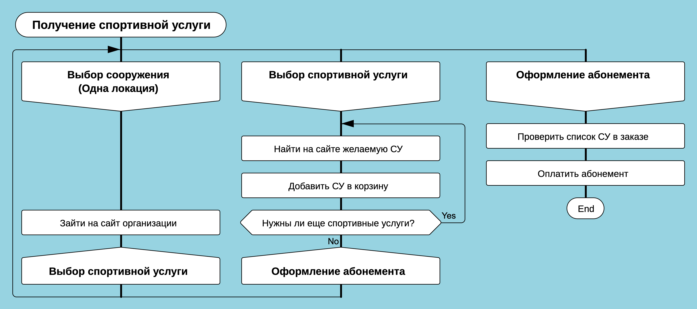
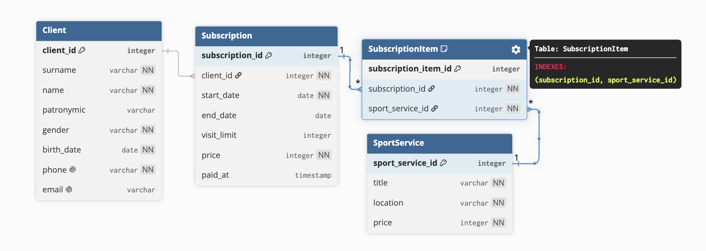
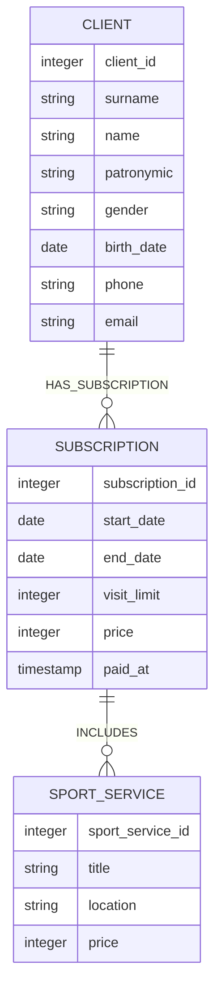

Выполнила Скогорева Анна, БПМИ238, 2026 год

## Предметная область
В качестве предметной области выбрана соревновательная деятельность, в рамках которой будут рассмотрены только факты посещения человеком спортивных сооружений и участия в организованных тренировках в рамках абонементов на такие мероприятия.

### Сущности предметной области
* Спортивная услуга (СУ) - в соответствии с определением по [ГОСТ Р 52024-2024](https://fs02.rchuv.ru/rchuv19/konnosport/docs/2025/01/20/70b335be-33c6-4a56-a09e-296e915eee04/gost-r-52024-2024-uslugi-fizu.pdf) (В ГОСТе дано определение физкультурно-оздоровительной и спортивной услуги, но для упрощения в рамках работы будем называть ее просто спортивной услугой)
* Клиент - получатель или покупатель СУ
* Абонемент - перечень СУ, которые приобретаются клиентом на определенный период или с фиксированным количеством посещений.

### Правила в предметной области
* Клиент может приобретать любое количество СУ в любое время.
* Любая СУ может быть оказана множеству любых Клиентов.
* Клиент оформляет Абонемент на перечень СУ и оплачивает его.
* Клиент может оформить любое количество Абонементов.
* В одном Абонементе не может быть несколько одинаковых СУ (понимаемых как идентичные услуги с одинаковыми условиями; например, нельзя включить «Утренний комплекс растяжки» дважды в один Абонемент).

### Упрощения в предметной области
* Клиент может приобрести любую Спортивную услугу, вне зависимости от того, подходит она ему или нет, например по возрасту, уровню подготовки или медицинским противопоказаниям.
* Все Спортивные услуги в рамках одного Абонемента оказываются в одном и том же спортивном сооружении.
* СУ оказываются только в одном филиале сети (одной локации).
* Абонемент не может быть анонимным (требуется идентификация клиента).

### Вопросы к предметной области
* Есть ли ошибочные данные, например, в одном Абонементе есть несколько одинаковых СУ?
* Какие Спортивные услуги наиболее популярны среди клиентов?
* Есть Спортивная услуга А, какие другие СУ можно порекомендовать клиенту вместе с ней?
* Какие Спортивные услуги образуют устойчивые кластеры в абонементах клиентов (например, их часто берут вместе)?
* В какое время суток или дни недели наблюдается пиковая загрузка по конкретным Спортивным услугам?

### Модель предметной области
В упрощенной модели предметной области, которая представлена на Диаграмме предметной области, клиент:
* Выбирает одно спортивное сооружение и заходит на сайт организации.
* Собирает Абонемент с набором спортивных услуг.
* Оформляет и оплачивает Абонемнет.
Принципиальная схема предметной области показывает взаимодействие трех сущностей: Клиент, Спортивная услуга (СУ) и Абонемент Моделирование на диаграмме выполнено с использованием нотации ДРАКОН и ресурса https://drakonhub.com/drakonhub 



### ER диаграмма
ER-модель описана в `DBML`. Код, для получения диаграммы лежит в файле [schema.dbml](schema.dbml), визуализация сделана на сайте  https://dbdiagram.io. 

Случай отношения `many-to-many` нормализуется через ассоциативную таблицу `SubscriptionItem`. Таблицы содержат данные о клиентах, сроке и цене Абонемента, локацию Спортивной услуги. Также на уровне модели данных реализовано выполнение правила “в одном Абонементе не может быть несколько одинаковых СУ” через составной unique-индекс в таблице `SubscriptionItem`.



## Реализация реляционной базы данных

Код для создания базы данных и ее наполнения:
```
cd relational
sqlite3 schedule.db < schema.sql
sqlite3 schedule.db < data.sql
```

Теперь можно проверить 
```
sqlite3 -header -column schedule.db < queries.sql
```

### Результаты:

1. Вопрос 1: есть ли дубли СУ в одном абонементе?
    ```
    Пустой ответ, потому что дублей никогда не будет изначально по самой схеме
    ```
1. Вопрос 2: самые популярные СУ (по числу абонементов)
    ```
    sport_service_id  title                       subscriptions_count
    ----------------  --------------------------  -------------------
    5                 Тренажёрный зал             19                 
    2                 Сауна                       14                 
    3                 Йога                        13                 
    4                 Утренний комплекс растяжки  13                 
    1                 Бассейн                     12                 
    7                 Пилатес                     6                  
    9                 Персональная тренировка     4                  
    10                Танцы (зумба)               2                  
    6                 Бокс                        1                  
    8                 Групповой кроссфит          1    
    ```              
1. Вопрос 2: самые популярные СУ (по числу уникальных клиентов)
    ```
    sport_service_id  title                       unique_clients_count
    ----------------  --------------------------  --------------------
    5                 Тренажёрный зал             15                  
    2                 Сауна                       12                  
    4                 Утренний комплекс растяжки  12                  
    1                 Бассейн                     11                  
    3                 Йога                        11                  
    7                 Пилатес                     5                   
    9                 Персональная тренировка     4                   
    10                Танцы (зумба)               2                   
    6                 Бокс                        1                   
    8                 Групповой кроссфит          1      
    ```
1. Вопрос 3: рекомендации к услуге А (sport_service_id = 1)     
    ```             
    recommended_service_id  recommended_service_title   co_occurrence_count
    ----------------------  --------------------------  -------------------
    2                       Сауна                       10                 
    5                       Тренажёрный зал             5                  
    4                       Утренний комплекс растяжки  2                  
    3                       Йога                        1                  
    7                       Пилатес                     1                  
    9                       Персональная тренировка     1 
    ```
1. Вопрос 4: устойчивые кластеры СУ (пары услуг с lift > 1) 
    ```
    service_a                   service_b                   times_together  lift
    --------------------------  --------------------------  --------------  ----
    Пилатес                     Персональная тренировка     2               2.83
    Утренний комплекс растяжки  Танцы (зумба)               2               2.62
    Бассейн                     Сауна                       10              2.02
    Йога                        Утренний комплекс растяжки  10              2.01
    Йога                        Пилатес                     3               1.31
    Йога                        Тренажёрный зал             9               1.24
    Тренажёрный зал             Пилатес                     4               1.19
    Утренний комплекс растяжки  Тренажёрный зал             8               1.1 
    Тренажёрный зал             Персональная тренировка     2               0.89
    Бассейн                     Тренажёрный зал             5               0.75
    Сауна                       Тренажёрный зал             5               0.64
    Бассейн                     Утренний комплекс растяжки  2               0.44
    ```
1. Пример ошибочного INSERT: не пройдёт, так как пара (subscription_id=1, sport_service_id=8) уже есть в SubscriptionItem, а на неё стоит UNIQUE-индекс
    ```
    Runtime error near line 66: UNIQUE constraint failed: SubscriptionItem.subscription_id, SubscriptionItem.sport_service_id (19)
    ```

## Реализация графовой базы данных
Код для реализации и наполнения БД живет в папке [graph](/graph/), это файлы с расширением `.cypher`. Для запуска и проверки можно использовать любое ПО для работы с Neo4j, например, Neo4j Desktop.




### Результаты
1. Вопрос 1: есть ли дубли СУ в одном абонементе?
    ```
    No changes, no records
    ```
1. Вопрос 2: самые популярные СУ (по числу абонементов)
    ```
    ╒═══════════════════╤════════════════════════════╤═══════════════════╕
    │ss.sport_service_id│ss.title                    │subscriptions_count│
    ╞═══════════════════╪════════════════════════════╪═══════════════════╡
    │5                  │"Тренажёрный зал"           │19                 │
    ├───────────────────┼────────────────────────────┼───────────────────┤
    │2                  │"Сауна"                     │14                 │
    ├───────────────────┼────────────────────────────┼───────────────────┤
    │3                  │"Йога"                      │13                 │
    ├───────────────────┼────────────────────────────┼───────────────────┤
    │4                  │"Утренний комплекс растяжки"│13                 │
    ├───────────────────┼────────────────────────────┼───────────────────┤
    │1                  │"Бассейн"                   │12                 │
    ├───────────────────┼────────────────────────────┼───────────────────┤
    │7                  │"Пилатес"                   │6                  │
    ├───────────────────┼────────────────────────────┼───────────────────┤
    │9                  │"Персональная тренировка"   │4                  │
    ├───────────────────┼────────────────────────────┼───────────────────┤
    │10                 │"Танцы (зумба)"             │2                  │
    ├───────────────────┼────────────────────────────┼───────────────────┤
    │6                  │"Бокс"                      │1                  │
    ├───────────────────┼────────────────────────────┼───────────────────┤
    │8                  │"Групповой кроссфит"        │1                  │
    └───────────────────┴────────────────────────────┴───────────────────┘
    ```
1. Вопрос 2: самые популярные СУ (по числу уникальных клиентов)
    ```
    ╒═══════════════════╤════════════════════════════╤════════════════════╕
    │ss.sport_service_id│ss.title                    │unique_clients_count│
    ╞═══════════════════╪════════════════════════════╪════════════════════╡
    │5                  │"Тренажёрный зал"           │15                  │
    ├───────────────────┼────────────────────────────┼────────────────────┤
    │4                  │"Утренний комплекс растяжки"│12                  │
    ├───────────────────┼────────────────────────────┼────────────────────┤
    │2                  │"Сауна"                     │12                  │
    ├───────────────────┼────────────────────────────┼────────────────────┤
    │3                  │"Йога"                      │11                  │
    ├───────────────────┼────────────────────────────┼────────────────────┤
    │1                  │"Бассейн"                   │11                  │
    ├───────────────────┼────────────────────────────┼────────────────────┤
    │7                  │"Пилатес"                   │5                   │
    ├───────────────────┼────────────────────────────┼────────────────────┤
    │9                  │"Персональная тренировка"   │4                   │
    ├───────────────────┼────────────────────────────┼────────────────────┤
    │10                 │"Танцы (зумба)"             │2                   │
    ├───────────────────┼────────────────────────────┼────────────────────┤
    │8                  │"Групповой кроссфит"        │1                   │
    ├───────────────────┼────────────────────────────┼────────────────────┤
    │6                  │"Бокс"                      │1                   │
    └───────────────────┴────────────────────────────┴────────────────────┘
    ```
1. Вопрос 3: рекомендации к услуге А (sport_service_id = 1)
    ```
    ╒══════════════════════╤════════════════════════════╤═══════════════════╕
    │recommended_service_id│recommended_service_title   │co_occurrence_count│
    ╞══════════════════════╪════════════════════════════╪═══════════════════╡
    │2                     │"Сауна"                     │10                 │
    ├──────────────────────┼────────────────────────────┼───────────────────┤
    │5                     │"Тренажёрный зал"           │5                  │
    ├──────────────────────┼────────────────────────────┼───────────────────┤
    │4                     │"Утренний комплекс растяжки"│2                  │
    ├──────────────────────┼────────────────────────────┼───────────────────┤
    │3                     │"Йога"                      │1                  │
    ├──────────────────────┼────────────────────────────┼───────────────────┤
    │7                     │"Пилатес"                   │1                  │
    ├──────────────────────┼────────────────────────────┼───────────────────┤
    │9                     │"Персональная тренировка"   │1                  │
    └──────────────────────┴────────────────────────────┴───────────────────┘
    ```
1. Вопрос 4: устойчивые кластеры СУ (пары услуг с lift > 1)
    ```
    ╒════════════════════════════╤════════════════════════════╤══════════════╤════╕
    │service_a                   │service_b                   │times_together│lift│
    ╞════════════════════════════╪════════════════════════════╪══════════════╪════╡
    │"Пилатес"                   │"Персональная тренировка"   │2             │2.83│
    ├────────────────────────────┼────────────────────────────┼──────────────┼────┤
    │"Утренний комплекс растяжки"│"Танцы (зумба)"             │2             │2.62│
    ├────────────────────────────┼────────────────────────────┼──────────────┼────┤
    │"Бассейн"                   │"Сауна"                     │10            │2.02│
    ├────────────────────────────┼────────────────────────────┼──────────────┼────┤
    │"Йога"                      │"Утренний комплекс растяжки"│10            │2.01│
    ├────────────────────────────┼────────────────────────────┼──────────────┼────┤
    │"Йога"                      │"Пилатес"                   │3             │1.31│
    ├────────────────────────────┼────────────────────────────┼──────────────┼────┤
    │"Йога"                      │"Тренажёрный зал"           │9             │1.24│
    ├────────────────────────────┼────────────────────────────┼──────────────┼────┤
    │"Тренажёрный зал"           │"Пилатес"                   │4             │1.19│
    ├────────────────────────────┼────────────────────────────┼──────────────┼────┤
    │"Утренний комплекс растяжки"│"Тренажёрный зал"           │8             │1.1 │
    ├────────────────────────────┼────────────────────────────┼──────────────┼────┤
    │"Тренажёрный зал"           │"Персональная тренировка"   │2             │0.89│
    ├────────────────────────────┼────────────────────────────┼──────────────┼────┤
    │"Бассейн"                   │"Тренажёрный зал"           │5             │0.75│
    ├────────────────────────────┼────────────────────────────┼──────────────┼────┤
    │"Сауна"                     │"Тренажёрный зал"           │5             │0.64│
    ├────────────────────────────┼────────────────────────────┼──────────────┼────┤
    │"Бассейн"                   │"Утренний комплекс растяжки"│2             │0.44│
    └────────────────────────────┴────────────────────────────┴──────────────┴────┘
    ```
1. Пример ошибочной операции: не пройдёт, так как client_id = 1 уже занят constraint-ом client_id_unique
    ```
    22N80: Data exception - index entry conflict
    Index entry conflict: Node(0) already exists with label `Client` and property `client_id` = 1.
    ```

Результаты работы полностью совплали с реализацией в реляционной модели.

## Выводы
### Структура схемы
В реляционной модели связь many-to-many между Subscription и SportService для качественной работы требует отдельной связующей таблицы SubscriptionItem. В графовой модели (LPG) это не нужно, так как связь выражается напрямую ребром INCLUDES

### Чтение связанных данных
Запросы вида «какие услуги входят в абонементы клиента» в SQL требуют JOIN трёх-четырёх таблиц подряд. В Cypher тот же запрос — это один MATCH с цепочкой `-[]->`, который читается почти как сама связь в предметной области (Client -> Subscription -> SportService). Чем длиннее цепочка связей в вопросе (рекомендации, кластеры), тем удобнее использовать графовую БД.

### Целостность данных
Реляционная модель строже: правило «в одном абонементе нет дублей СУ» обеспечено физически через UNIQUE-индекс на уровне СУБД вставка дубля гарантированно упадёт с ошибкой. В графовой модели такого нет. То же правило либо проверяется на уровне приложения, либо обеспечивается дисциплиной использования MERGE вместо CREATE. Это значимый минус LPG для предметной области, где целостность важна.

### Аналитические запросы (рекомендации, кластеры)
Оба варианта решают задачу, но логика в Cypher для многошаговых обходов (например, «найти все услуги, встречавшиеся в тех же абонементах») выглядит естественнее, тк нет необходимости явно соединять промежуточную таблицу. В SQL та же задача решается через self-join по SubscriptionItem, что менее наглядно, хотя и не сложнее с точки зрения производительности на небольшом объёме данных.

### Масштабируемость и инструментарий
Реляционная БД остаётся более универсальным выбором для данной предметной области в целом (отчётность, агрегаты). Графовая модель раскрывает преимущество именно на вопросах 3 и 4 (рекомендации и кластеры), где суть задачи состоит в анализе связей, а не агрегация атрибутов. На больших объёмах данных и более сложных цепочках связей (например, «клиенты, похожие по составу абонементов, друг на друга») разница в пользу графа стала бы заметнее.

### Общий итог
Выбор модели должен осуществляться на основе соответствия типа вопросов и имеющихся данных. Для учётных и целостных задач (кто что оплатил, нет ли ошибок) удобнее реляционная модель. Для задач анализа связей и рекомендаций (что берут вместе, что предложить дальше) удобнее графовая. На практике эти подходы не взаимоисключающие и крупная система могла бы вести реляционную БД как источник истины и периодически выгружать данные в граф для аналитических задач о связях.